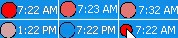

# About

Since the rise of technology human relationships have really changed, and now it’s even possible to rely on algorithms to find  your soulmate. While in person we use a varicolored language, online we only communicate with combinations of 0 and 1. Nevertheless, the latter seems to work better.

_What if communicating directly like machines could help us find true love more easily?_

N01 is a web experience that allows you to find your soulmate only talking with one bit messages. The project takes inspiration from the experiment held at Cornell University, called "Communicating Intimacy One Bit at a Time", where chosen couples could only communicate using one bit messages. The idea behind N01 is the same one: The server connects two people; every time one of them touches the heart button, it generates a sound in the other person’s device. The purpose is to find each other and physically connect. N01 not only finds your match, but also your soulmate. As the ultimate love guru, N01 knows what’s best for you, but to get it you have to communicate with its language. 

**Table of Contents**

1. N01 
   a. [Binary Code](#binarycode) 
   b. [Exhibition](#exhibition) 
2. Experience 
   
   a. [Matching](#matchings) 
   b. [Happy endings](#happy-endings) 

3. [Team](#team) 

# N01

## Binary Code

The project has the aim to make present the basic language of every machine: binary code. N01 takes inspiration from the experiment held at Cornell University, called "Communicating Intimacy One Bit at a Time", where chosen couples in long-distance relationships could only communicate using one bit messages. the results suggested  that even a one-bit communication device is seen by users as a valuable and rich channel for communicating intimacy, despite the availability of wider channels.
In the same way N01 connects people and show them that even with the smaller amount of possibilities, you can connect and bond with someone. 

## Exhibition

The experience is designed as an interactive exhibition that takes place in a room. From the outside, people will be attracted by the pink soft lights. Before entering the room, the user reads the concept and can decide to join. A computer is placed right next the entrance and a qr code is displayed on its monitor. The user scans it and finally the experience begins. 

# Experience

## structure

## landing page
The whole aesthetic of N01 is playful and a bit silly, taking inspiration from love calculator’s websites on old computers.
Cheesy love quotes and heart patterns make N01 almost feel like a dating site. The experience is created to make people have fun and enjoy, but also to reflect on the metaphor behind it. 
The experince itselfs starts with color recognition (parte del codice) 

After scanning the qr code the forst page visible is the landing page, where you can either start the experience or go directly to the final gallery. 
The structure was made with html linked pages... 
Another interesting aspect of the homepage is the wallpaper creted with a dithering effect...

## Matching
parte codice del matching 
## Happy endings
parte della gallery
# The code

##

# Team

Meet the team 

## Credits

Draw With Code: Creative Coding 2021/2022  
Politecnico di Milano – Dipartimento di Design

### Faculty

- Michele Mauri
- Tommaso Elli
- Andrea Benedetti

