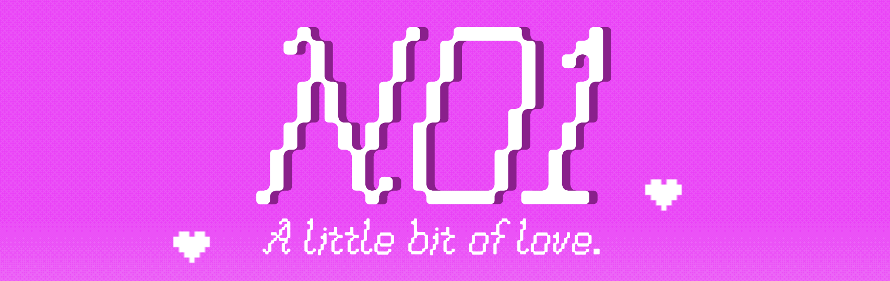
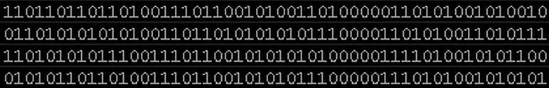
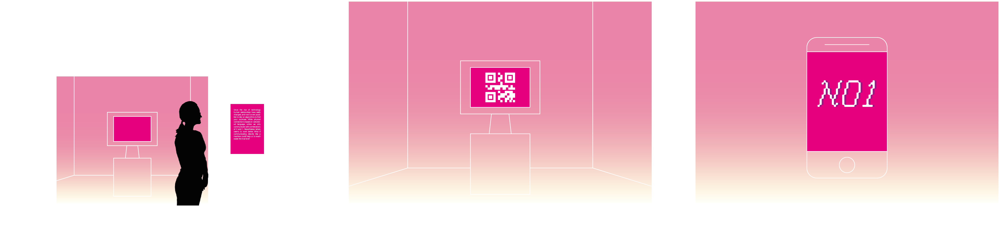
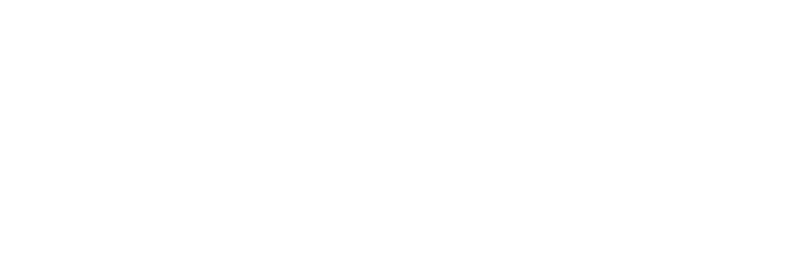
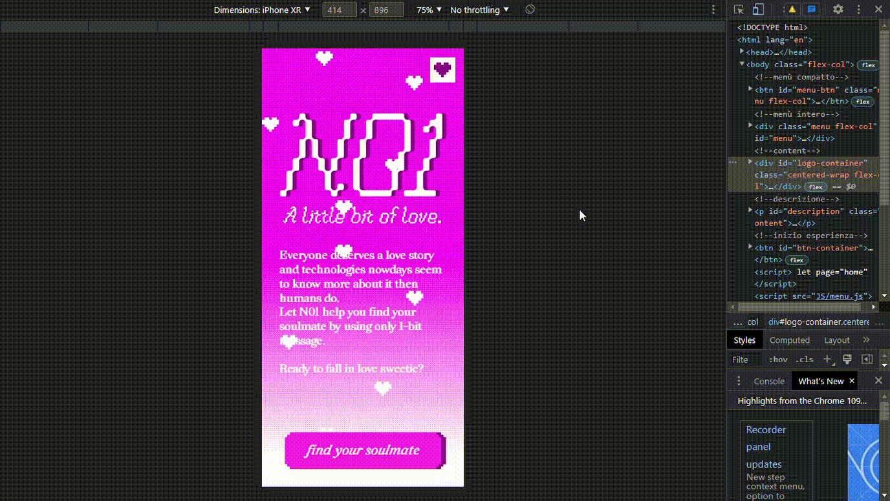
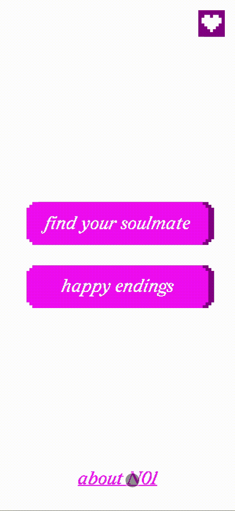
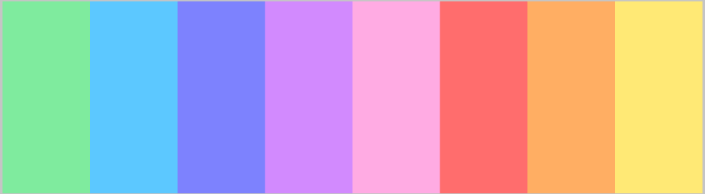

Since the rise of technology human relationships have really changed, and now it’s even possible to rely on algorithms to find  your soulmate. While in person we use a varicolored language, online we only communicate with combinations of 0 and 1. Nevertheless, the latter seems to work better.  


#### *What if communicating directly like machines could help us find true love more easily?*

N01 is a web experience that allows you to *find your soulmate only talking with one bit messages*. 
The project takes inspiration from the experiment held at Cornell University, called "Communicating Intimacy One Bit at a Time", where chosen couples could only communicate using one bit messages. The idea behind N01 is the same one: The server connects two people; every time one of them touches the heart button, it generates a sound in the other person’s device. The purpose is to find each other and physically connect. N01 not only finds your match, but also your soulmate. As the ultimate love guru, N01 knows what’s best for you, but to get it you have to communicate with its language. 
N01 is a web experience that allows you to find your soulmate only talking with one bit messages.

The server connects two people; every time one of them touches the heart button, it generates a sound in the other person’s device. The purpose is to find each other and physically connect. N01 not only finds your match, but also your soulmate. As the ultimate love guru, N01 knows what’s best for you, but to get it you have to communicate with its language. 


#### **Table of Contents**
1. Concept  
   a. [Binary Code](#binary-code)<br>
   b. [Exhibition](#exhibition)<br>
   c. [Structure](#structure)<br>

2. Experience  
   a. [Homepage](#homepage)<br>
   b. [Experience](#experience)<br>
   c. [Happy Ending](#output-and-happy-endings)<br>  

3. [Team](#team)<br>


# ***Concept***

## Binary Code
<!--<div style="margin-right: 80px;" ></div>
  -->

The project has the aim to make *present* the basic language of every machine: *binary code*. 

N01 takes inspiration from the experiment held at Cornell University *Communicating Intimacy One Bit at a Time*, where chosen couples in long-distance relationships could only communicate using one bit messages. the results suggested  that even a one-bit communication device is seen by users as a valuable and rich channel for communicating intimacy, despite the availability of wider channels. In the same way N01 connects people and show them that even with the smaller amount of possibilities, you can connect and bond with someone. 

<!-- <br clear="left"/> -->


## Exhibition


The experience is designed as an interactive exhibition that takes place in a room. From the outside, people will be attracted by the pink soft lights. Before entering the room, the user reads the concept and can decide to join. A computer is placed right next the entrance and a QR code is displayed on its monitor. The user scans it and finally the experience begins. 


## Structure
The website can be divided into 3 different parts:
1. ***Homepage*** from which you can either go directly to the gallery part or start the experience <br>
2. ***Experience*** which in turn can be divided into 4 parts <br>
   a. *Login and rules* of the experience <br>
   b. *Waiting list* where the user will be associated to another one <br>
   c. *Matching* actually with the assiociated <br>
   d. *Output* of the experience, generated by the inputs sent by the two partecipants<br>
3. ***Happy endings*** where all the output will be displayed <br>



These parts corresponds to a flow composed of 5 html pages (the home, the login, the experience, the output and the gallery), each linked to a different css and a javascript file, plus three other javascripts documents that add features common to all the pages. 
###


# Experience
## Homepage
After scanning the qr code the first page visible is the landing page, where you can either start the experience or go directly to the final gallery.</br>

<div align="center"> 
   
  
</div> 

</br> The whole aesthetic of N01 is playful and a bit silly, taking inspiration from love calculator’s websites on old computers. Cheesy love quotes and heart patterns make N01 almost feel like a dating website. The experience is created to make people have fun and enjoy, but also to reflect on the metaphor behind it.</br></br>


<!-- <div display="flex" justify-content=" space-eavenly"  style="margin-right:20%">align-items= "center" 
<p width="60%">-->
  <!--<div >
    
     
     
  </div> 
</div>-->

#### ---------------------------------------------------*behind the code*---------------------------------------------------
The most interesting parts of the code are the *dithered background* and the *small hearts animation*

#### *dithered background*
To process the pixels of the canva the code is composed of three functions, one the callback of the other. 
In the function `draw` the context of the canvas is processed as an array of pixels and passed as an argument of the second function.

```javascript
//first function

ctx = p1.canvas.getContext('2d');

let gradient = ctx.createLinearGradient(0, valMapped, 0,  p1.height);
  gradient.addColorStop(0, userColor);
  gradient.addColorStop(1, "white");

let imageData = ctx.getImageData( 0, 0, p1.width, p1.height );
  dither(imageData, [imageData.data.buffer]);
```
The second function `clamps` the r, g, b values of the pixels of the canvas within a certain range to limit the color depth of the image. It then iters through two `for loop`, one within the other, to define a new array of pixels. 
The iterations `map` the range of values for each channel, that usuually goes from 0 to 255, to another range that is defined as an ` array of arrays ` at the beginning of the code.

```javascript 
//second function
function dither (imageData, []){
    // imageData
    const width = imageData.width;
    const pixels = imageData.data;
    const dither = dithers["rgb_4"];
    
    const intensity = (r, g, b) =>
    Math.floor(0.2126 * r + 0.7152 * g + 0.0722 * b);
    const clamp = (val, min, max) => Math.max(min, Math.min(val, max));
    const map = (val, min1, max1, min2, max2) =>
    ((val - min1) / (max1 - min1)) * (max2 - min2) + min2;
    
    const map = (val, min1, max1, min2, max2) => ((val - min1) / (max1 - min1)) * (max2 - min2) + min2;
    
    // filter
    for (let i = 0; i < pixels.length; i += 4) {
      const x = (i / 4) % width;
      const y = Math.floor(i / 4 / width);
      const colors = pixels.slice(i, i + 3);
    
      for (let c = 0; c < 3; c++) {
        const thresholdMap = thresholdMaps[dither.mapIndex[c]];
        const mapSide = thresholdMap.length;
        const mapSize = mapSide * mapSide ;
        const threshold = thresholdMap[x % mapSide][y % mapSide];
        const numColors = dither.colorCount[c];

        const color = Math.floor(
          clamp( (numColors * colors[c]) / 256 + threshold / mapSize - 0.5,  0, numColors - 1)
        );
        const nearestColor = Math.floor(map(color, 0, numColors - 1, 0, 255));
    
        pixels[i + c] = nearestColor;
      }
    }
    
    drawCanvas(ctx, imageData);
}
 ```
In the third function the array of pixels is then applied to the context of the original canvas to redraw its pixels. 

 ```javascript
//third function
function drawCanvas(cnv, img) {
    cnv.canvas.width = img.width;
    cnv.canvas.height = img.height;
    ctx.putImageData(img, 0, 0);
}
 
```
credits to: [`kamoroso94/ordered-dither`](https://github.com/kamoroso94/ordered-dither) <br>


#### *heart animation*

```javascript
let heartImage;
let arrayHeart= [];

//definisco la classe
class Heart {
  constructor(x, y){
      this.x = x;
      this.y = y;
  }
  move() {

    this.y= this.y-2

    p2.push();

      p2.translate(this.x, this.y);
      p2.image(heartImage, 0, 0);

    p2.pop()
  }
}

if (page=="home"){
  p2 = new p5(sketch)

  p2.draw= function(){
    p2.clear()
    
    p2.canvas.id = "animation-hearts"
    
    for(let i = 0; i < arrayHeart.length; i++) {arrayHeart[i].move()}

  }

  //NEW HEART ON CLICK
  document.addEventListener("click", clickHeart);

  function clickHeart(){
    let xHeart= p2.mouseX
    let yHeart= p2.mouseY
    arrayHeart.push(new Heart(xHeart, yHeart))
  }

  //HEART SPAWNING
  setInterval(spawnHeart,3000)
  function spawnHeart(){
    
    let xHeart= p2.random(0, p2.canvas.width)
    let yHeart= p2.canvas.height
    arrayHeart.push(new Heart(xHeart, yHeart))
    
  }
}
```


###
## Experience

### login
The first step requires to log into the web site with the personal name or a nickname, so the platform can start matching people. <br>
Everyone gets assigned a color, which will identify them in the further steps. <br>



### Waiting
While waiting for a match to be made, an array of cheesy love quotes will appear to entertain the user.

<div align= "center">
<p float="left">
  
  
  
</p>
</div>

### Matching
When the match is made, the people have to start sending messages touching the heart button, that will result in a sound in the other person's device. The two people will have then to find one another physically, so the connection between the two is completed.  This is how the matching system works: <br>
```javascript
//takes the first two waiting users and pairs them
function pair() {
    console.log("pairing")
    waiting[0].pairedId = waiting[1].id
    waiting[1].pairedId = waiting[0].id
    unpaired -= 2;

    io.to(waiting[0].id).emit("paired", waiting[1])
    io.to(waiting[1].id).emit("paired", waiting[0])

    //start the users' timers
    for (let i = 0; i <= 1; i++){
        let user = getUser(waiting[i].id)
        user.timer = setInterval(function () {
            user.updateMsg()
        }, CLOCK)
    }

    console.log("paired " + waiting[0].id + " and " + waiting[1].id)
    waiting.splice(0, 2);
    console.log(waiting)
}
```

### Output
At the end of the experience it would be possible to see the heart that you and your parter generated
This is how we create the artwork: 

## Happy endings
The gallery is made with a Firebase realtime database that allow the users to check out all their matches few seconds after the update
This is how we used firebase for the final gallery:
```javascript
import { artwork } from "/public/JS/firebase.js"

//function that controls when datas get imported from database every 100 milliseconds
let loadingTime = setInterval( ()=>{

  if (artwork!=undefined){ //if the atwork exists the gallery gets generated 

    setTimeout( galleryCreation ,1800)
    clearInterval(loadingTime, loadingQuotes);

  } else quotesDisplay //or the loading animation gets called 

}, 100)


let outputs= []
let container= document.getElementById("img-ctn")

function galleryCreation () {
  
  document.body.classList.add("active"); //change div's flex
  (document.getElementById("loading")).style.display="none";

  //generates an array from database's datas
  outputs= Object.keys(artwork).map( function(key) {
      return artwork[key];
    });

  outputs.forEach(element => {
    
    let imgdata= document.createElement("img")
    
    imgdata.src= element.data;
    imgdata.classList.add("artwork");
    
    container.appendChild(imgdata);
    document.body.appendChild(imgdata);

  })
}
```


# Team

Letteralmente N01


## Credits

Draw With Code: Creative Coding <br>
Academic Year 2022/2023 <br>
Politecnico di Milano – Dipartimento di Design

### Faculty

 Michele Mauri
 Tommaso Elli
 Andrea Benedetti


