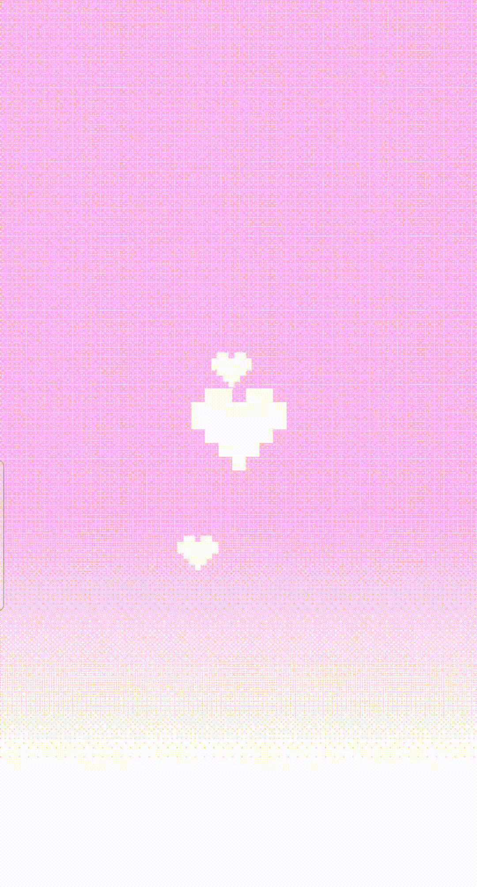
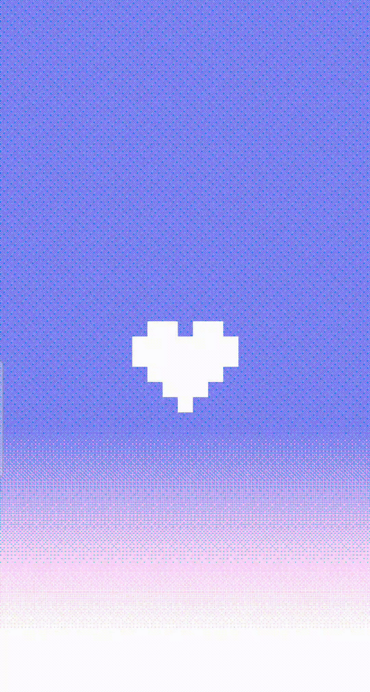

Since the rise of technology human relationships have really changed, and now it’s even possible to rely on algorithms to find your soulmate. While in person we use a varied language, online we only communicate with combinations of 0 and 1. Nevertheless, the latter seems to work better. </br>

#### **What if communicating like machines could help us find true love? <3**</br></br>

N01 is a web experience that allows you to ***find your soulmate only talking with 1-bit messages***.  

The project takes inspiration from the experiment held at Cornell University, called *Communicating Intimacy One Bit at a Time*, where chosen couples could only communicate using one bit messages. The idea behind N01 is the same one: The server connects two people; every time one of them touches the heart button, it generates a sound in the other person’s device.

The aim of the experience is to show the language behind the messages that we exchange on the web, binary code, and to do so it makes fun of the numerous apps and websites that now-days aims to find us our soulmate.  
These technology use human communication to obtain a digital connection, while N01 does the contrary: the purpose of the website is to make us ***look for each other communicating digitally but physically connect***. 

N01 in this sense present itself as the ultimate love guru: a website that knows what’s best for you, but to get its knowledge you have to communicate with its language.

---

## **INDEX <3**  

1. #### Concept (っ◕‿◕)っ ♡      
   1.1 [binary code](#binary-code)<br>
   1.2 [structure](#structure)<br>

2. #### Experience (´ε｀ )♡       
   2.1 [exhibition](#exhibition)<br>
   2.2 [homepage](#homepage)<br>
   2.3 [login](#login)<br>
   2.4 [matching](#matching)<br>
   2.5 [artwork](#experience)<br>
   2.6 [gallery](#experience)<br>

3. #### Credits (｡♡‿♡｡)     
   3.1 [info](#info)<br>
   3.2 [letteralmenteN01](#letteralmenteN01)<br>


---

# **Concept (っ◕‿◕)っ ♡**

## *Binary Code*


The project has the aim to make *present* the basic language of every machine: ***binary code***. 

N01 takes inspiration from the experiment held at Cornell University *Communicating Intimacy One Bit at a Time*, where chosen couples in long-distance relationships could only communicate using 1-bit messages. The results suggested that even a system of communication apparently very limited can be a valuable and rich channel for communicating a wide range of messages. 
In the same way N01 connects people trough single bit of information to show how the complexity of the digital communication is actually obtained through a very simple language, composed of only 0 and 1. It makes visible the vastity of outputs that a small amount of possibility can generate. </br>

## *Structure*
The website is composed of five main html pages: the home, the login, the experience, the output and the gallery.  
Each document is then linked to a global css, for the features in common with all the pages, and a personalized css for its peculiar characteristics. The same is for the javascript files. 


###

---

# **Experience (´ε｀ )♡**
The whole aesthetic of N01 is playful and a bit silly, taking inspiration from love calculator’s websites on old computers. Cheesy love quotes and heart patterns make N01 almost feel like a dating website. The experience is created to make people have fun and enjoy, but also to reflect on the metaphor behind it.</br></br>


## *Exhibition*


The experience is held in room of an art-exhibition. The space is illuminated by soft pink lamps, intringuing the people to come closer. </br>
Before entering the room, a printed sheet will display the concept of the project and a computer placed right next the entrance will display the QR code that enables to access to the website. 


---

## *Homepage*
After scanning the QR code the first page visible is the home. From it the user is able to access the experience and, by opening the menu, open the final gallery and the README file in the githup repository.</br>

<div align="center"> 
   
  
</div> 

#### --------------------------------------------------------- *code insight* ---------------------------------------------------------

#### *dithered background*
To process the pixels of the canva the code is composed of three functions, one the callback of the other. 
In the function `draw` the context of the canvas is processed as an array of pixels and passed as an argument of the second function.
```javascript  

//first function
ctx = p1.canvas.getContext('2d');

let gradient = ctx.createLinearGradient(0, valMapped, 0,  p1.height);
  gradient.addColorStop(0, userColor);
  gradient.addColorStop(1, "white");

let imageData = ctx.getImageData( 0, 0, p1.width, p1.height );
  dither(imageData, [imageData.data.buffer]);
```
The second function `clamps` the r, g, b values of the pixels of the canvas within a certain range to limit the color depth of the image. It then iters through two `for loop`, one within the other, to define a new array of pixels. 
The iterations `map` the range of values for each channel, that usuually goes from 0 to 255, to another range that is defined as an ` array of arrays ` at the beginning of the code.

```javascript 
//second function
function dither (imageData, []){
  // imageData
  const width = imageData.width;
  const pixels = imageData.data;
  const dither = dithers["rgb_4"];
  
  const intensity = (r, g, b) =>
  Math.floor(0.2126 * r + 0.7152 * g + 0.0722 * b);
  const clamp = (val, min, max) => Math.max(min, Math.min(val, max));
  const map = (val, min1, max1, min2, max2) =>
  ((val - min1) / (max1 - min1)) * (max2 - min2) + min2;
  
  const map = (val, min1, max1, min2, max2) => ((val - min1) / (max1 - min1)) * (max2 - min2) + min2;
  
  // filter
  for (let i = 0; i < pixels.length; i += 4) {
    const x = (i / 4) % width;
    const y = Math.floor(i / 4 / width);
    const colors = pixels.slice(i, i + 3);
  
    for (let c = 0; c < 3; c++) {
      const thresholdMap = thresholdMaps[dither.mapIndex[c]];
      const mapSide = thresholdMap.length;
      const mapSize = mapSide * mapSide ;
      const threshold = thresholdMap[x % mapSide][y % mapSide];
      const numColors = dither.colorCount[c];

      const color = Math.floor(
        clamp( (numColors * colors[c]) / 256 + threshold / mapSize - 0.5,  0, numColors - 1)
      );
      const nearestColor = Math.floor(map(color, 0, numColors - 1, 0, 255));
  
      pixels[i + c] = nearestColor;
    }
  }
  drawCanvas(ctx, imageData);
}  

 ```
In the third function the array of pixels is then applied to the context of the original canvas to redraw its pixels. 

 ```javascript
//third function
function drawCanvas(cnv, img) {
    cnv.canvas.width = img.width;
    cnv.canvas.height = img.height;
    ctx.putImageData(img, 0, 0);
}
```
---

### Login
The first step requires to log into the web-site with the personal name or a nickname. This input is necessary both to render the final output and to save the artwork into the firebase gallery. <br> 
After the input some instructions guide the user into the next step of the experience.

<div align= "center">
  
</div>

---

### Matching
While waiting for a match to be made, each user is assigned randomly a cheesy love quote.

<div align= "center">
  
  
  
</div>

When the match is made, the people have to start sending messages touching the heart button, that will result in a sound in the other person's device. When the two people phisically meet they have to scan the respective devices to identify each other. After that the connection between the two is completed.

<div align= "center">
  
  
</div>


#### --------------------------------------------------------- *code insight* ---------------------------------------------------------
 

```javascript
function socketSetup() {
  clientSocket.on("morse", morseReceived)//makes the other user device play a sound
  clientSocket.on("paired", statusUpdate)//if the users are paired stops the loading animation
  clientSocket.on("unpaired", statusUpdate)// else keeps the user waiting
  clientSocket.on("success", successReceive)//saves the data sent by the two users in the local.storage 
}

```
```javascript
//when user sends morse message, forward to paired user
socket.on("morse", function (data) {
    var sender = getUser(this.id);
    var receiverId = sender.pairedId;
    
    if (receiverId != 0) {
        io.to(receiverId).emit("morse", data)

        //save the state of the sender (pressing or not)
        sender.active = data;
    }
    
    console.log(this.id + " - morse")
})

```

<!--
#### *color detection*

The matching of the two users is done by scanning the color of the dithered canvas displayd on its device. The scanning works with the method `get` of `p5`, which returns an array of the r, g, b values of the pixels of an image. The camera looks indeed for the color assiged to the user by the server, and to detect if the color that is framing is correct it subtracts the r,g,b values of the pixels of nitial color to the one of the image.

```javascript
const PIXEL_TRESHOLD = 50 //max 422 min 0
const PERCENT_THRESHOLD = 0.7 //max 1 min 0

function colorSearch(targetHex) {
  let total = 0;
  let target = color(targetHex)

  let r = red(target)
  let g = green(target)
  let b = blue(target)

  let sub = video.get(subX, subY, subW, subH);

  p1.image(sub, p1.width / 2 - subW / 2, p1.height * 2 / 3 - subH / 2)
  
  let distanceTotal = 0;

  for (let x = 0; x < subW; x++){
    for (let y = 0; y < subH; y++){

      let pixel = sub.get(x,y)

      let diffR = Math.abs(red(pixel) - r)
      let diffG = Math.abs(green(pixel) - g)
      let diffB = Math.abs(blue(pixel) - b)

      let distance = Math.sqrt(diffR * diffR + diffG * diffG + diffB * diffB)
      distanceTotal += distance;
      
      if (distance < PIXEL_TRESHOLD) {
        total++
      }
    }
  }
  
  let avgDist = distanceTotal / (subH * subW)
  p1.text(Math.round(avgDist*100)/100 + " success%: " + (total / (subH * subW)), 10, 10)
  let result = (total / (subH * subW) > PERCENT_THRESHOLD)

  return result
}
```
-->

---

### Output
The data sent by the two users are stored is used to render an artwork. The image consists of a pixeleted-heart divided in two half, one for each partecipant. The color of the heart is the one assigned by the server during the experience session while the name is the input given by the user in the first section of the website. </br>

<div align= "center">
  
  
  
</div>

#### --------------------------------------------------------- *code insight* ---------------------------------------------------------

The artwork, generated as a `p5.Graphics` in the setup, is rendered as an image into the draw function and then processed with the method `getImageData` to be exported as a `string` to the javascript file linked to firebase.
</br>

```javascript

let names = sessionStorage.getItem("name1") + " + " + sessionStorage.getItem("name2")

p2 = new p5(sketch); //SECONDARY CANVA

p2.draw = function (){
  p2.resizeCanvas(windowWidth*3/4, windowHeight/3);
  p2.canvas.id= "output";
  p2.canvas.style.display="none";

  p2.image(outp, 0,0);//<I draw the artwork

  artwork = p2.canvas.toDataURL();//I convert the artwork to save it in the database

  writeUserData(names, artwork)//I call the firebase function that saves the artwork with user's name

  p2.noLoop()
}
```
---

### Gallery

At last but not least, the ouput of the users is displayed in a gallery where they can see all the other artworks generated by the communication between all the partecipants of the experience. 

<div align= "center">
  
</div>

#### --------------------------------------------------------- *code insight* ---------------------------------------------------------

Firebase functions are imported in an external javascript file of type `module`. This documents exports and imports functions and variables both from the javascripts file of the ouput and the gallery to get and set data into the database. </br>
The method `get` in particular, returns an `array` of all the elements contained under a certain `#key` from the database. The `key` is defined using the inputs of the users, saving just one object per match.

```javascript

export function writeUserData(userId, data) {
  set(ref(db, 'N01-gallery/'+ userId), {
    data: data
  });
}

let artwork;

get(ref(db, `N01-gallery/`)).then((snapshot) => {
  if (snapshot.exists()) {
    artwork = snapshot.val()
  } else {
    console.log("No data available");
  }
}).catch((error) => {
  console.error(error);
});

export {artwork};
```
---

# **Credits (｡♡‿♡｡)**

## ***Attributions***

[Socket.io](https://socket.io/) - to install the communication between the clients and the server 
[render](https://render.com/) - to host the website
[Firebase](https://console.firebase.google.com/) -to host the database
[p5.library](https://p5js.org/) - to generate the graphic elements

[`kamoroso94/ordered-dither`](https://github.com/kamoroso94/ordered-dither) - for the dithering algorithm
 
--- 

## ***Letteralmente N01 <3***  

#### Davide Agostinelli
####  Elisa Debenettis 
#### Martina Esposito
####  Giulia Gnessi   

--- 

Draw With Code: Creative Coding <br>
Academic Year 2022/2023 <br>
Politecnico di Milano – Dipartimento di Design

#### Faculty
 Michele Mauri  
 Tommaso Elli  
 Andrea Benedetti  
  
(*･∀･)／♡＼(･∀･*) 

