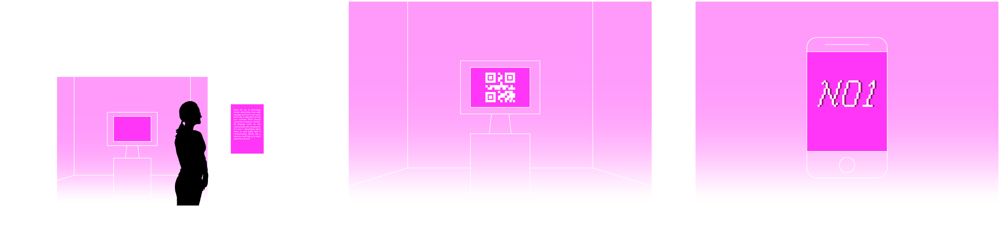

Since the rise of technology human relationships have really changed, and now it’s even possible to rely on algorithms to find  your soulmate. While in person we use a varicolored language, online we only communicate with combinations of 0 and 1. Nevertheless, the latter seems to work better.</br></br>

#### ***What if communicating directly like machines could help us find true love more easily? <3***

N01 is a web experience that allows you to ***find your soulmate only talking with one bit messages***. 
The project takes inspiration from the experiment held at Cornell University, called *Communicating Intimacy One Bit at a Time*, where chosen couples could only communicate using one bit messages. The idea behind N01 is the same one: The server connects two people; every time one of them touches the heart button, it generates a sound in the other person’s device. The purpose is to find each other and physically connect. N01 not only finds your match, but also your soulmate. As the ultimate love guru, N01 knows what’s best for you, but to get it you have to communicate with its language. 
N01 is a web experience that allows you to find your soulmate only talking with one bit messages.

The server connects two people; every time one of them touches the heart button, it generates a sound in the other person’s device. The purpose is to find each other and physically connect. N01 not only finds your match, but also your soulmate. As the ultimate love guru, N01 knows what’s best for you, but to get it you have to communicate with its language. 

---

#### **INDEX**  

1. Concept (っ◕‿◕)っ ♡      
   a. [binary code](#binary-code)<br>
   b. [structure](#structure)<br>

2. Experience (´ε｀ )♡       
   a. [exhibition](#exhibition)<br>
   b. [homepage](#homepage)<br>
   c. [login](#login)<br>
   d. [matching](#matching)<br>
   e. [artwork](#experience)<br>
   f. [gallery](#experience)<br>

3. Credits (｡♡‿♡｡)     
   a. [letteralmenteN01](#letteralmenteN01)<br>
   b. [info](#info)<br>


---

# **Concept (っ◕‿◕)っ ♡**

## *Binary Code*


<!--<div style="margin-right: 80px;" ></div>
  -->

The project has the aim to make *present* the basic language of every machine: *binary code*. 

N01 takes inspiration from the experiment held at Cornell University *Communicating Intimacy One Bit at a Time*, where chosen couples in long-distance relationships could only communicate using one bit messages. the results suggested  that even a one-bit communication device is seen by users as a valuable and rich channel for communicating intimacy, despite the availability of wider channels. In the same way N01 connects people and show them that even with the smaller amount of possibilities, you can connect and bond with someone. </br>

<!-- <br clear="left"/> -->

## *Structure*
The website can be divided into 3 different parts:
1. ***Homepage*** from which you can either go directly to the gallery part or start the experience <br>
2. ***Login***  <br>
   a. *Experience*  <br>
  
   B.. *Output* of the experience, generated by the inputs sent by the two partecipants<br>
3. ***Gallery*** where all the outputs will be displayed <br>


These parts corresponds to a flow composed of five html pages (the home, the login, the experience, the output and the gallery), each linked to a different css and a javascript file, plus three additional javascripts documents that add features common to all the pages. 
###

---

# **Experience (´ε｀ )♡**

The whole aesthetic of N01 is playful and a bit silly, taking inspiration from love calculator’s websites on old computers. Cheesy love quotes and heart patterns make N01 almost feel like a dating website. The experience is created to make people have fun and enjoy, but also to reflect on the metaphor behind it.</br></br>


### *Exhibition*


The experience is held in room of an art-exhibition. The space is illuminated by soft pink lamps, intringuing the people to come closer. </br>
Before entering the room, a printed sheet will display the concept of the project and a computer placed right next the entrance will display the QR code that enables to access to the website. 


---

## *Homepage*
After scanning the QR code the first page visible is the home. From it the user is able to access the experience and, by opening the menu, open the final gallery and the README file in the githup repository.</br>

<div align="center"> 
   
  
</div> 

<!-- <div display="flex" justify-content=" space-eavenly"  style="margin-right:20%">align-items= "center" 
<p width="60%">-->
  <!--<div >
    
     
     
  </div> 
</div>-->

#### ------------------------------------------------------ *code insights* ------------------------------------------------------

#### *dithered background*
To process the pixels of the canva the code is composed of three functions, one the callback of the other. 
In the function `draw` the context of the canvas is processed as an array of pixels and passed as an argument of the second function.

```javascript
//first function

ctx = p1.canvas.getContext('2d');

let gradient = ctx.createLinearGradient(0, valMapped, 0,  p1.height);
  gradient.addColorStop(0, userColor);
  gradient.addColorStop(1, "white");

let imageData = ctx.getImageData( 0, 0, p1.width, p1.height );
  dither(imageData, [imageData.data.buffer]);
```
The second function `clamps` the r, g, b values of the pixels of the canvas within a certain range to limit the color depth of the image. It then iters through two `for loop`, one within the other, to define a new array of pixels. 
The iterations `map` the range of values for each channel, that usuually goes from 0 to 255, to another range that is defined as an ` array of arrays ` at the beginning of the code.

```javascript 
//second function
function dither (imageData, []){
    // imageData
    const width = imageData.width;
    const pixels = imageData.data;
    const dither = dithers["rgb_4"];
    
    const intensity = (r, g, b) =>
    Math.floor(0.2126 * r + 0.7152 * g + 0.0722 * b);
    const clamp = (val, min, max) => Math.max(min, Math.min(val, max));
    const map = (val, min1, max1, min2, max2) =>
    ((val - min1) / (max1 - min1)) * (max2 - min2) + min2;
    
    const map = (val, min1, max1, min2, max2) => ((val - min1) / (max1 - min1)) * (max2 - min2) + min2;
    
    // filter
    for (let i = 0; i < pixels.length; i += 4) {
      const x = (i / 4) % width;
      const y = Math.floor(i / 4 / width);
      const colors = pixels.slice(i, i + 3);
    
      for (let c = 0; c < 3; c++) {
        const thresholdMap = thresholdMaps[dither.mapIndex[c]];
        const mapSide = thresholdMap.length;
        const mapSize = mapSide * mapSide ;
        const threshold = thresholdMap[x % mapSide][y % mapSide];
        const numColors = dither.colorCount[c];

        const color = Math.floor(
          clamp( (numColors * colors[c]) / 256 + threshold / mapSize - 0.5,  0, numColors - 1)
        );
        const nearestColor = Math.floor(map(color, 0, numColors - 1, 0, 255));
    
        pixels[i + c] = nearestColor;
      }
    }
    
    drawCanvas(ctx, imageData);
}
 ```
In the third function the array of pixels is then applied to the context of the original canvas to redraw its pixels. 

 ```javascript
//third function
function drawCanvas(cnv, img) {
    cnv.canvas.width = img.width;
    cnv.canvas.height = img.height;
    ctx.putImageData(img, 0, 0);
}
 
```
credits to: [`kamoroso94/ordered-dither`](https://github.com/kamoroso94/ordered-dither) <br>

<!-- 
#### *heart animation*
The animation is defined as a method of a `class`. On `click` a new object is pushed into an array that is then itered in the draw function to apply the function to all of its elements.

```javascript
class Heart {
  constructor(x, y){
      this.x = x;
      this.y = y;
  }

  move() {

    this.y= this.y-4

    p1.push();
      p1.translate(this.x, this.y);
      p1.image(heartImage, 0, 0);
    p1.pop()
  }
}

//NEW HEART ON CLICK
document.addEventListener("click", function(){
  let xHeart= p1.mouseX-heartImage.width
  let yHeart= p1.mouseY-heartImage.height
  arrayHeart.push(new Heart(xHeart, yHeart))//al click aggiungo un cuore all'array
})
```
-->

---

### Login
The first step requires to log into the web-site with the personal name or a nickname. This input is necessary both to render the final output and to save the artwork into the firebase gallery. <br> 
After the input some instructions guide the user into the next step of the experience.

<div align= "center">
  
</div>

---

### Matching
While waiting for a match to be made, each user is assigned randomly a cheesy love quote.

<div align= "center">
  
  
  
</div>

When the match is made, the people have to start sending messages touching the heart button, that will result in a sound in the other person's device. When the two people phisically meet they have to scan the respective devices to identify each other. After that the connection between the two is completed.

<div align= "center">
  
  
</div>


#### ------------------------------------------------------ *code insights* ------------------------------------------------------

#### *matching*
To match the users the server compiles an array of all the clients connected. 

```javascript
//takes the first two waiting users and pairs them
function pair() {
    console.log("pairing")
    let pairingUsers = [getUser(waiting[0]), getUser(waiting[1])]

    for (let i = 0; i < pairingUsers.length; i++){
        let user = pairingUsers[i]
        //assign paired id to users
        user.pairedId = pairingUsers[1 - i].id
        
        //assign colors to users
        user.assignColor()

        //start timers
        user.timer = setInterval(function () {
            user.updateMsg()
        }, CLOCK)
    }

    let msg = [{}, {}];

    for (let i = 0; i < msg.length; i++){
        //send users pair id
        msg[i].id = pairingUsers[1 - i].id

        //send users their color and color to search
        msg[i].userColor = pairingUsers[i].color
        msg[i].pairColor = pairingUsers[1 - i].color

        //send users color of paired
        msg[i].pairName = pairingUsers[1 - i].name

        //send the message
        io.to(pairingUsers[i].id).emit("paired", msg[i])
    }

    console.log("paired " + pairingUsers[0].id + " and " + pairingUsers[1].id)
    waiting.splice(0, 2);
    console.log(waiting)
}
```

#### *1bit-communication*

The communication between the users is obtained with the `emit` method of the 

```javascript
//takes the first two waiting users and pairs them
function pair() {
    console.log("pairing")
    waiting[0].pairedId = waiting[1].id
    waiting[1].pairedId = waiting[0].id
    unpaired -= 2;

    io.to(waiting[0].id).emit("paired", waiting[1])
    io.to(waiting[1].id).emit("paired", waiting[0])

    //start the users' timers
    for (let i = 0; i <= 1; i++){
        let user = getUser(waiting[i].id)
        user.timer = setInterval(function () {
            user.updateMsg()
        }, CLOCK)
    }

    console.log("paired " + waiting[0].id + " and " + waiting[1].id)
    waiting.splice(0, 2);
    console.log(waiting)
}
```
#### *recognition*

#### *inputs storage*

---

### Output
The data sent by the two users are stored is used to render an artwork. The image consists of a pixeleted-heart divided in two half, one for each partecipant. The color of the heart is the one assigned by the server during the experience session while the name is the input given by the user in the first section of the website. </br>

<div align= "center">
  
  
  
</div>

#### ------------------------------------------------------ *code insights* ------------------------------------------------------

<!-- 
#### *output*
The data sent by the two users are stored in the `local.storage` of the website and used to render an artwork. The image consists of a pixeleted-heart divided in two half, and it is obtained by itering the inputs of the two users, saved as elements of an `array`, into another `for loop` that draws the shape of the heart. </br>

```javascript

function graphicOutput(){//////OUTPUT

  outp= p1.createGraphics(p1.width*3/4, p1.height/3);

  let size = (outp.width/2) / rows;//definisco la dimensione in base alla width della canvas
  let myindex = 0;

  outp.push()
  for (let i = 0; i < grid1[0].length; i++) {
    for (let j = 0; j < grid1.length; j++) {
      if (grid1[j][i] == 1) {
        if (message1[myindex] == 1) outp.fill("white");
        else outp.fill(color1);
        outp.noStroke()
        outp.square(i *size + size/2, j *size, size);
        myindex++;
      }
    }
  }
  outp.pop()

  outp.push()
  for (let i = 0; i < grid2[0].length; i++) {
    for (let j = 0; j < grid2.length; j++) {
      if (grid2[j][i] == 1) {
        if (message2[myindex] == 1) outp.fill("white");
        else outp.fill(color2);
        outp.noStroke()
        outp.square(i *size +(outp.width/2)-size/2, j *size, size);
        myindex++;
      }
    }
  }
  outp.pop()
  
  outp.fill(255);
  outp.textSize(30);
  outp.textFont(Redaction)
  outp.textAlign(outp.CENTER)
  outp.text(names, outp.width/2, outp.height)
}

```
The artwork is generated as a `p5.Graphics` in the setup and rendered as an image into the draw function of two different `p5 sketches`:
-`p1` the main canvas, downloadable by the user as a png file in their device
-`p2` secondary hidden canvas, created to save the artwork into the Firebase database. This second canva is indeed processed with the method `getImageData` and exported as an `url` to the javascript file linked to firebase.
</br>

```javascript
p1 = new p5(sketch) //MAIN CANVA

p1.draw = function (){

  p1.canvas.id = "bgCanvas"

  //other lines of code

  p1.image(outp, (windowWidth-outp.width)/2,  (windowHeight-outp.height)/2);
}
-->

```javascript

p2 = new p5(sketch); //SECONDARY CANVA

p2.draw = function (){
  p2.resizeCanvas(windowWidth*3/4, windowHeight/3);
  p2.canvas.id= "output";
  p2.canvas.style.display="none";

  p2.image(outp, 0,0);//<I draw the artwork

  artwork = p2.canvas.toDataURL();//I convert the artwork to save it in the database

  writeUserData(names, artwork)//I call the firebase function that saves the artwork with user's name

  p2.noLoop()
}
```

The artwork, generated as a `p5.Graphics` in the setup, are rendered as an image into the draw function and then processed with the method `getImageData` to be exported as an `string` to the javascript file linked to firebase.
</br>

---

### Gallery

At last but not least, the

#### ------------------------------------------------------ *code insights* ------------------------------------------------------

```javascript

export function writeUserData(userId, data) {
  set(ref(db, 'N01-gallery/'+ userId), {
    data: data
  });
}

let artwork;

get(ref(db, `N01-gallery/`)).then((snapshot) => {
  if (snapshot.exists()) {
    artwork = snapshot.val()
  } else {
    console.log("No data available");
  }
}).catch((error) => {
  console.error(error);
});

export {artwork};
```
Firebase functions are indeed imported in an external javascript file of type `module`. This documents exports and imports functions and variables both from the javascripts file of the ouput and the gallery to get and set data into the database. </br>
The method `get` in particular, returns an `array` of all the elements contained under a certain `#key` from the database. The `key` is defined using the inputs of the users, saving just one object per match.

<!--
The gallery is made with a Firebase realtime database that allows the users to check out all their matches few seconds after the update
This is how we used firebase for the final gallery:

```javascript
import { artwork } from "/public/JS/firebase.js"

//function that controls when datas get imported from database every 100 milliseconds
let loadingTime = setInterval( ()=>{

  if (artwork!=undefined){ //if the atwork exists the gallery gets generated 

    setTimeout( galleryCreation ,1800)
    clearInterval(loadingTime, loadingQuotes);

  } else quotesDisplay //or the loading animation gets called 

}, 100)


let outputs= []
let container= document.getElementById("img-ctn")

function galleryCreation () {
  
  document.body.classList.add("active"); //change div's flex
  (document.getElementById("loading")).style.display="none";

  //generates an array from database's datas
  outputs= Object.keys(artwork).map( function(key) {
      return artwork[key];
    });

  outputs.forEach(element => {
    
    let imgdata= document.createElement("img")
    
    imgdata.src= element.data;
    imgdata.classList.add("artwork");
    
    container.appendChild(imgdata);
    document.body.appendChild(imgdata);

  })
}
```
-->
---

# **Credits (｡♡‿♡｡)**

## ***Letteralmente N01***
<div align= "center">
  
  

  (*･∀･)／♡＼(･∀･*)      
</div>

## Info

Draw With Code: Creative Coding <br>
Academic Year 2022/2023 <br>
Politecnico di Milano – Dipartimento di Design

 Michele Mauri  
 Tommaso Elli  
 Andrea Benedetti  


