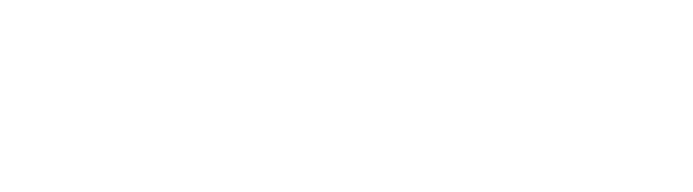

   

# About

Since the rise of technology human relationships have really changed, and now it’s even possible to rely on algorithms to find  your soulmate. While in person we use a varicolored language, online we only communicate with combinations of 0 and 1. Nevertheless, the latter seems to work better.

_What if communicating directly like machines could help us find true love more easily?_

N01 is a web experience that allows you to find your soulmate only talking with one bit messages. The project takes inspiration from the experiment held at Cornell University, called "Communicating Intimacy One Bit at a Time", where chosen couples could only communicate using one bit messages. The idea behind N01 is the same one: The server connects two people; every time one of them touches the heart button, it generates a sound in the other person’s device. The purpose is to find each other and physically connect. N01 not only finds your match, but also your soulmate. As the ultimate love guru, N01 knows what’s best for you, but to get it you have to communicate with its language. 
N01 is a web experience that allows you to find your soulmate only talking with one bit messages.

The server connects two people; every time one of them touches the heart button, it generates a sound in the other person’s device. The purpose is to find each other and physically connect. N01 not only finds your match, but also your soulmate. As the ultimate love guru, N01 knows what’s best for you, but to get it you have to communicate with its language. 

**Table of Contents**

1. N01<br>
   a. [Binary Code](#binary-code)<br>
   b. [Exhibition](#exhibition)<br>
2. Experience<br>   
   a. [Homepage](#homepage)<br>
   b. [Experience](#experience)<br>
   c. [Happy Ending](#output-and-happy-endings)<br>  

3. [Team](#team)<br>


# N01

## Binary Code

<p align="center">
  
</p>


The project has the aim to **make present the basic language of every machine: binary code**. N01 takes inspiration from the experiment held at Cornell University, called "Communicating Intimacy One Bit at a Time", where chosen couples in long-distance relationships could only communicate using one bit messages. the results suggested  that even a one-bit communication device is seen by users as a valuable and rich channel for communicating intimacy, despite the availability of wider channels.
In the same way N01 connects people and show them that even with the smaller amount of possibilities, you can connect and bond with someone. 


## Exhibition


The experience is designed as an interactive exhibition that takes place in a room. From the outside, people will be attracted by the pink soft lights. Before entering the room, the user reads the concept and can decide to join. A computer is placed right next the entrance and a qr code is displayed on its monitor. The user scans it and finally the experience begins. 


# Structure

The website cn be divided into 3 different parts:
1. **Homepage** from which you can either go directly to the gallery part or start the experience <br>
2. **Experience** which in turn can be divided into 4 parts <br>
   a. _Login and rules_ of the experience <br>
   b. _Waiting list_ where the user will be associated to another one <br>
   c. _Matching_ actually with the assiociated <br>
   d. _Output_ of the experience that will be sent to the gallery <br>
3. **Happy endings** where all the output will be displayed <br>



## Homepage

<div align= "center">
<p float="left">
  
  
  
</p>
</div>

The whole aesthetic of N01 is playful and a bit silly, taking inspiration from love calculator’s websites on old computers.
Cheesy love quotes and heart patterns make N01 almost feel like a dating website. The experience is created to make people have fun and enjoy, but also to reflect on the metaphor behind it. After scanning the qr code the first page visible is the landing page, where you can either start the experience or go directly to the final gallery. <br>
The structure was made with html linked pages. 
An interesting aspect of the homepage is the wallpaper, created with a dithering effect, and the animation of little hearts.
We took inspiration from a code on github: https://github.com/kamoroso94/ordered-dither <br>
```javascript
//pixel get processsed
function dither (imageData, []){
    // imageData
    const width = imageData.width;
    const pixels = imageData.data;
    const dither = dithers["rgb_4"];
    
    const intensity = (r, g, b) =>
    Math.floor(0.2126 * r + 0.7152 * g + 0.0722 * b);
    const clamp = (val, min, max) => Math.max(min, Math.min(val, max));
    const map = (val, min1, max1, min2, max2) =>
    ((val - min1) / (max1 - min1)) * (max2 - min2) + min2;
    //taking a value it riconverts the pixel in a certain range
    
```

## Experience

### login
The first step requires to log into the web site with the personal name or a nickname, so the platform can start matching people. <br>
Everyone gets assigned a color, which will identify them in the further steps. <br>


### Waiting
While waiting for a match to be made, an array of cheesy love quotes will appear to entertain the user.

<div align= "center">
<p float="left">
  
  
  
</p>
</div>

### Matching
When the match is made, the people have to start sending messages touching the heart button, that will result in a sound in the other person's device. The two people will have then to find one another physically, so the connection between the two is completed.  This is how the matching system works: <br>
```javascript
//takes the first two waiting users and pairs them
function pair() {
    console.log("pairing")
    waiting[0].pairedId = waiting[1].id
    waiting[1].pairedId = waiting[0].id
    unpaired -= 2;

    io.to(waiting[0].id).emit("paired", waiting[1])
    io.to(waiting[1].id).emit("paired", waiting[0])

    //start the users' timers
    for (let i = 0; i <= 1; i++){
        let user = getUser(waiting[i].id)
        user.timer = setInterval(function () {
            user.updateMsg()
        }, CLOCK)
    }

    console.log("paired " + waiting[0].id + " and " + waiting[1].id)
    waiting.splice(0, 2);
    console.log(waiting)
}
```

### Output
At the end of the experience it would be possible to see the heart that you and your parter generated
This is how we create the artwork: 

## Happy endings
The gallery is made with a Firebase realtime database that allow the users to check out all their matches few seconds after the update
This is how we use firebase


# Team

Letteralmente N01


## Credits

Draw With Code: Creative Coding <br>
Academic Year 2022/2023 <br>
Politecnico di Milano – Dipartimento di Design

### Faculty

 Michele Mauri
 Tommaso Elli
 Andrea Benedetti


